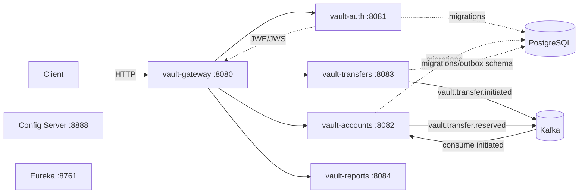
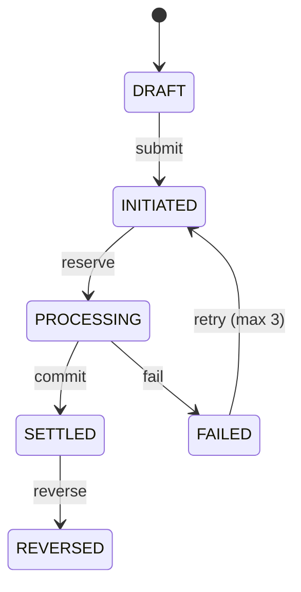

# Architecture

## Current component map

Solid links are implemented application behaviour. Dashed links are schema/configuration preparation; `Config Server` and `Eureka` are independent applications and are not part of the quick-start request path yet.

## Request flow

1. Client calls gateway.
2. `/auth/**` routes directly to auth. Other routes require a `Bearer` JWE when gateway RSA keys are configured.
3. Gateway decrypts JWE, verifies the inner JWS and expiration, removes `Authorization`, then passes `X-User-Id` and `X-User-Role` downstream.
4. Auth registers a demo user, verifies a TOTP code and returns an opaque token. Users are presently process-local.
5. Transfers creates a `DRAFT`; submitting it transitions it to `INITIATED` and emits `vault.transfer.initiated`.
6. Accounts deduplicates the received event in memory and emits `vault.transfer.reserved`. Balance reservation is intentionally not implemented until persistent atomic updates are in place.

## Domain state model

The pure `Transfer.transition` method currently enforces this model. Spring State Machine is included but has not yet replaced it; that is deliberate to keep the current code truthful and testable.

## Data ownership

| Service | Owns | Current storage | Target storage |
| --- | --- | --- | --- |
| auth | identities, password hash, encrypted TOTP secret | process memory | PostgreSQL + R2DBC |
| accounts | accounts, balance, account audit | process memory | PostgreSQL + R2DBC |
| transfers | transfer state, history, outbox | process memory | PostgreSQL + R2DBC |
| reports | read model | static stub | Oracle XE read model |

## Production roadmap

### Persistence and money invariants

Use R2DBC repositories and optimistic versions for transfers. Debit/reserve with one conditional SQL update (`balance >= amount` and `status = ACTIVE`), not a read-modify-write sequence. Write transfer state, audit entry and outbox record in the same PostgreSQL transaction.

### KMS-backed TOTP encryption

Use envelope encryption: a per-user AES-256-GCM DEK encrypts the TOTP secret; a cloud KMS or Vault Transit encrypts that DEK. Store ciphertext, nonce, encrypted DEK and key version. Production must fail closed when KMS is unavailable.

### Transactional outbox and inbox

`outbox_events` is already declared in the transfer Liquibase changelog. A publisher should claim rows via `FOR UPDATE SKIP LOCKED`, publish idempotently, and mark acknowledgement atomically. Consumers need an inbox table keyed by `eventId`, retry policies for infrastructure failures only, and dead-letter topics for exhausted messages.

### Operational acceptance criteria

- Testcontainers tests for PostgreSQL, Kafka and Redis.
- JaCoCo/PIT and Checkstyle enforced by CI.
- TLS/SASL Kafka, ACLs, idempotent producer and schema-versioned events.
- Actuator probes, tracing export, dashboards for consumer/outbox lag and alerts for DLT messages.
- Kubernetes Deployments/Services for every service, resource limits, network policies, managed Secret injection and restore-tested backups.
